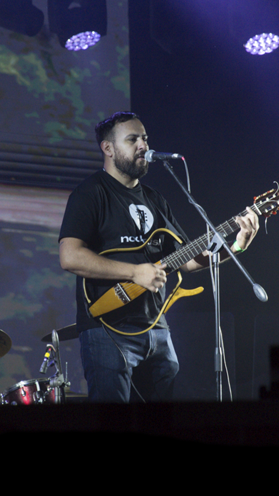

# NOCKAISH — Sitio Web Oficial

Sitio web del dúo de folclore santiagueño **NOCKAISH** (Lupin y Lucho).

---

## Estructura del proyecto

```
nockaish/
├── index.html          ← Página principal (todo en un archivo)
├── README.md           ← Este archivo
└── assets/             ← (crear esta carpeta para tus archivos)
    ├── images/         ← Fotos del dúo
    ├── afiches/        ← Imágenes de afiches
    └── gacetilla/      ← nockaish_gacetilla_prensa.docx
```

---

## Cómo agregar imágenes

### Fotos (sección Galería)
En el `index.html`, buscá la sección `<!-- IMÁGENES -->` y reemplazá cada `<div class="galeria-item">` por:

```html
<div class="galeria-item">
  
</div>
```

### Afiches
En la sección `<!-- AFICHES -->`, reemplazá cada `<div class="afiche-item">` por:

```html
<div class="afiche-item">
  
</div>
```

---

## Cómo subir a GitHub

1. Creá una cuenta en [github.com](https://github.com) si no tenés.
2. Hacé clic en **"New repository"** → llamalo `nockaish-web` (público).
3. En tu computadora, abrí la terminal y ejecutá:

```bash
git init
git add .
git commit -m "Primer versión del sitio"
git branch -M main
git remote add origin https://github.com/TU_USUARIO/nockaish-web.git
git push -u origin main
```

O bien usá **GitHub Desktop** (más fácil): arrastrá la carpeta y publicá.

---

## Cómo desplegar en Netlify (recomendado)

1. Entrá a [netlify.com](https://netlify.com) y creá una cuenta gratuita.
2. Hacé clic en **"Add new site" → "Import an existing project"**.
3. Conectá tu cuenta de GitHub y elegí el repositorio `nockaish-web`.
4. Configuración de build:
   - **Build command**: (dejar vacío)
   - **Publish directory**: `.` (punto, o la raíz)
5. Hacé clic en **"Deploy site"**.

Tu sitio quedará en `https://nockaish.netlify.app` (o podés configurar un dominio propio).

---

## Cómo desplegar en Vercel (alternativa)

1. Entrá a [vercel.com](https://vercel.com) y creá una cuenta gratuita.
2. Hacé clic en **"Add New Project"** → importá desde GitHub.
3. Seleccioná `nockaish-web`.
4. Hacé clic en **"Deploy"** — Vercel lo detecta automáticamente.

---

## Personalización rápida

| Qué cambiar | Dónde en el HTML |
|---|---|
| Colores del sitio | Variables CSS en `:root { --tierra, --arena, --ocre... }` |
| Número de teléfono | Sección `#contacto` → `contacto-item` |
| Links de redes | `<a href="https://instagram.com/...">` y `<a href="https://youtube.com/...">` |
| Texto de la gacetilla | Sección `#gacetilla` → `gacetilla-body` |
| Agregar video de YouTube | Podés insertar un `<iframe>` en la sección `#musica` |

---

## Dominio personalizado (opcional)

Una vez publicado en Netlify o Vercel, podés conectar un dominio propio como `nockaish.com.ar`.
Compralo en [NIC Argentina](https://nic.ar) (~$500 ARS/año para `.com.ar`).

---

*Sitio diseñado para NOCKAISH — Folclore Santiagueño*
